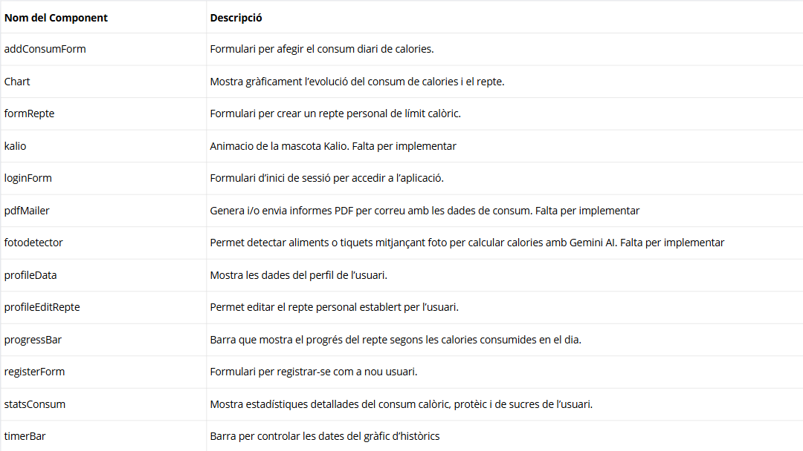

# Documentació de l'Aplicació de Seguiment de Calories

## Arquitectura

*Descripció general de l'arquitectura del projecte. Explica com es connecta el frontend amb el backend, si es fa servir API REST, quina estructura de carpetes té el projecte, etc.*

### Diagrama d'Arquitectura

---

## BBDD

*Esquema de la base de dades. Detalla les taules, relacions, camps més importants (com l’usuari, reptes, consums de calories...). Pots afegir aquí diagrames o sentències SQL si cal.*

### Diagrama de la Base de Dades

---

## Components Front

*Llista i descripció dels components principals del frontend. Pots incloure el nom del component, què fa i com s’utilitza (inclou el fitxer o ruta si vols).*

### Estructura de Components

---

## Disseny

**Paleta de colors del projecte:**

- **Color principal 1**: `#2D1B52` (Color fosc per a fons i elements destacats)
- **Color secundari 1**: `#8A2BE2` (Color lila per a accents i interaccions)
- **Color destacat 1**: `#FF7A00` (Color taronja per a crides a l'acció)
- **Color secundari 2**: `#3C3145` (Color de fons i elements complementaris)

---

**Fonts Utilitzades:**

*No s'ha aplicat cap tipografia personalitzada. L'aplicació utilitza les fonts predeterminades del navegador (com Arial, Helvetica o sans-serif), que garanteixen compatibilitat i una bona llegibilitat en qualsevol dispositiu.*
*Si es volgués aplicar una tipografia personalitzada, es podria considerar l'ús de Google Fonts o fonts autònomes, però actualment no s'ha implementat cap d'aquestes opcions.*

---
### Ús de gràfics i barres de progrés

- **Gràfics (Chart component)**: S’utilitzen per visualitzar l’evolució del consum calòric i comparar-lo amb el límit diari. Ofereixen una visió ràpida i entenedora del rendiment de l’usuari.
- **Barres de progrés**: Mostren de forma visual el percentatge de calories consumides en relació amb el repte diari, motivant l’usuari a assolir els seus objectius.